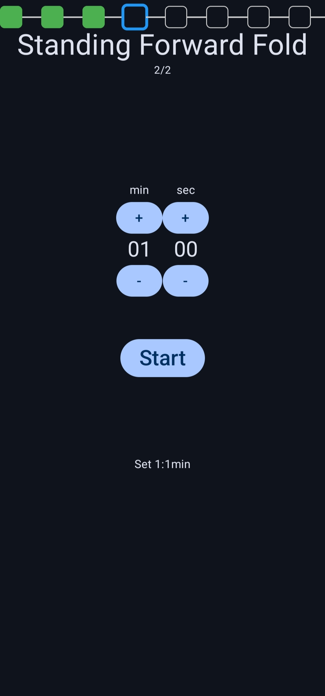
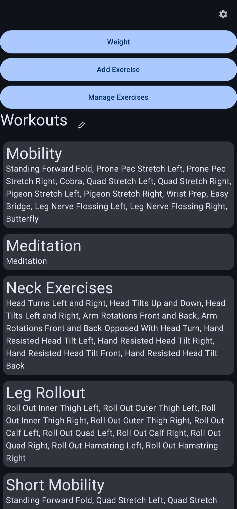

# Fitness App
This is an Android app to plan and track your workouts. You can also use the app to track your weight.
The initial idea for the app was to circumvent complicated workout setup by using text-only workout descriptions.

The app supports completing exercises in your workout in arbitrary order.
This can be useful if machines/stations are currently occupied or if you simply feel like switching up the order :).

<p align="center">
      
&nbsp; &nbsp; &nbsp; &nbsp;
      
</p>
The main menu offers different entry points.

Workouts are made out of groups, so that you can repeat sequences of exercises. A workout description has the following format:
```
[Exercise 1, Exercise 2] x 3
[Exercise 3] x 4
```

## Roadmap
Most of the screens have been migrated to Jetpack Compose. The plan is to
- migrate remaining screens
- add more features
    - water intake tracking
    - timer during workout
